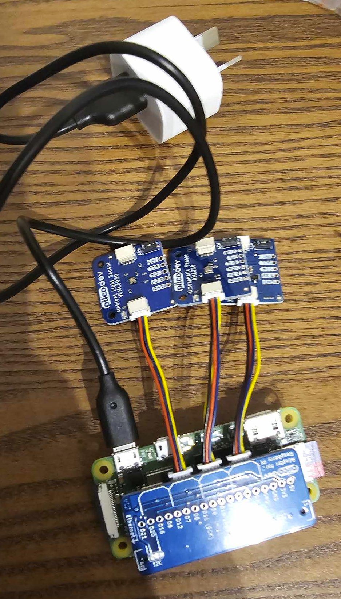

# pi-weather-station
Link to website displaying the data: https://www.ashwingur.com/Weather

Code for reading atmospheric, air quality and light sensor data on the Raspberry-Pi using PiicoDev components. This script runs once every 5 minutes and posts the data to my api endpoint at api.ashwingur.com/weather.

## Components used

- Raspberry Pi Zero 2W (host computer)
- PiicoDev Adapter for Raspberry Pi
- PiicoDev Sensors
  - PiicoDev Air Quality Sensor ENS160
  - PiicoDev Atmospheric Sensor BME280
  - PiicoDev Ambient Light Sensor VEML6030

All sensors are attached to the adapter via custom PiicoDev cables. They use I2C for communication.

Make sure charger is 5V and supplies enough current. The one I used is an old iphone charger that gives 5V 1A.



## Pi Setup

Use the Raspberry Pi imager app to format a micro SD card. In additional settings, ensure that a hostname is setup with username and password, and allow for SSH connections. This way we don't need to connect any peripherals to the Pi, only the power cable.

You can now SSH into the pi (mine is `ashwin@weatherstation.local` or `ssh ashwin@raspberrypi`)

```
ssh yourusername@yourhostname.local
```

For the PiicoDev libraries to work, we need to create a virtual python environment

```
mkdir piicodev-env
python3 -m venv ~/Desktop/piicodev-env/
source ~/Desktop/piicodev-env/bin/activate
pip install piicodev
```

Ensure I2C is enabled on the pi through the following menu

```
sudo raspi-config
```

Schedule a cron to run the script every 5 minutes

```
crontab -e
```

We need to make sure it runs with the virtual environment python version. Paste this into the crontab (change username as required)

```
*/5 * * * * cd /home/ashwin/Desktop/piicodev-env/pi-weather-station && /home/ashwin/Desktop/piicodev-env/bin/python sensor_measurements.py
```

Note my API needs 2 environment variables, create a `.env` file.

```
USER_ID=PI-WEATHER-STATION
WEATHER_POST_PASSWORD=XXX
```
